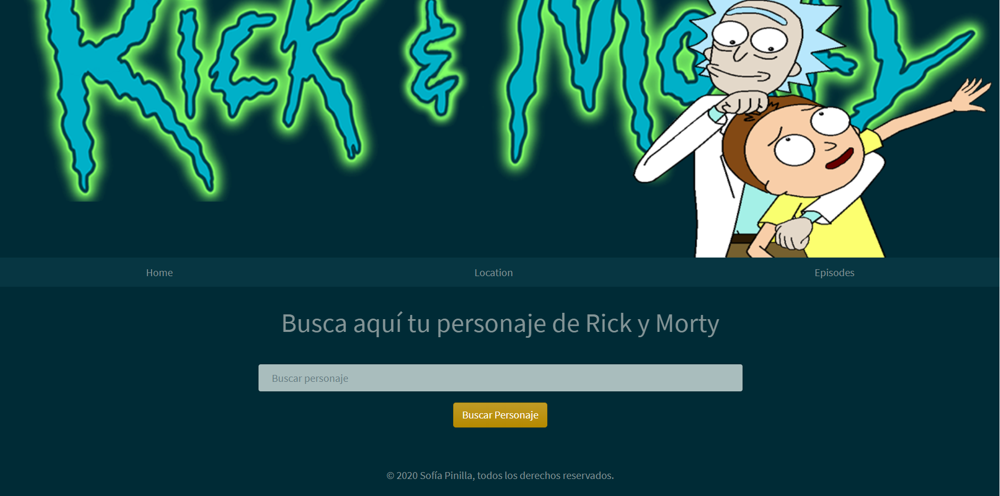
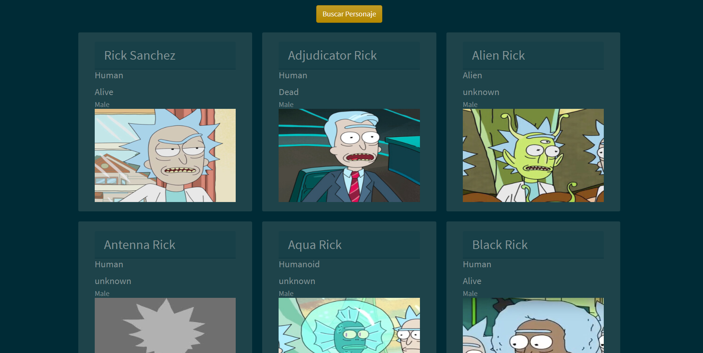
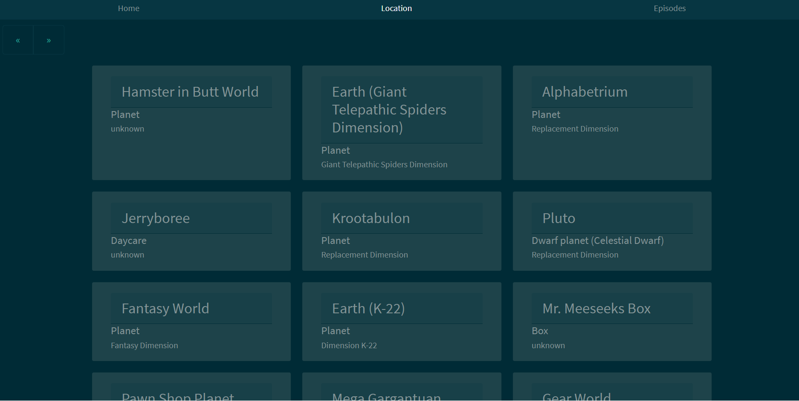
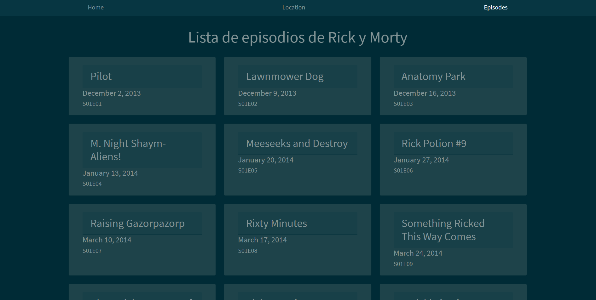
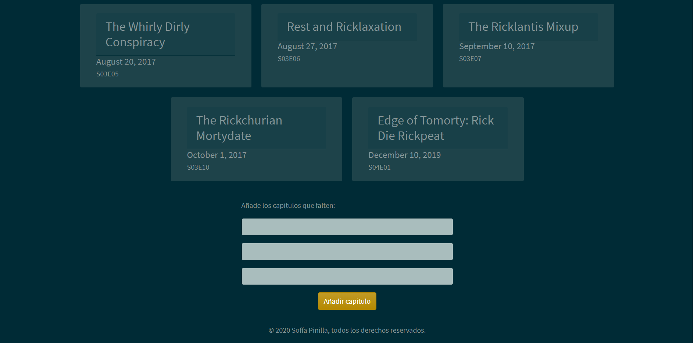
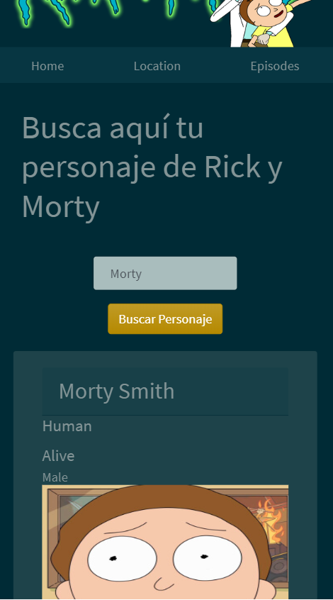

# GeeksHubs-P4---ApiRickyMorty
Este proyecto es una api de Rick y Morty, en la cual puedes buscar personajes de Rick y Morty, ver los diferentes mundos que 
tiene(locations) ,ver la lista de episodios, y si falta algún episodio, puedes actualizarlo tu mism@ con el formulario 
que dejo a tu disposición.

## Tecnologías que he utilizado 🛠️

>Mi api esta creada con HTML5 , CSS3,Layout( Flex ),Bootstrap, Responsive Design,
JavaScript, Axios,Node, Express, Sequelize y Mysql Workbench.

 ---

#### Preview
Escribe el nombre del personaje que quieras y el buscador te lo mostrará.

 


 

 ---
 
Locations

 

 ---
 
Lista de episodios

 

Formulario para añadir los nuevos episodios 

 

---

Aquí se puede apreciar que la pagina es responsive.

 

---

### Instalación 🔧

Para poder iniciar el proyecto primero haz un clone:

```
git clone https://github.com/SofiaPinilla/GeeksHubs-P4---ApiRickyMorty.git
```
Una vez clonado el proyecto, debes instalar los modulos necesarios con npm:
```
npm i express sequelize axios mysql2
```

Ya esta listo el proyecto, ahora para iniciarlo debes levantar el backend con node:
```
cd backend
```
```
node app
```

Y levantar el frontend con live server o iniciar tu index.html.

---
Hecho por [Sofía Pinilla](https://github.com/SofiaPinilla) 😊
